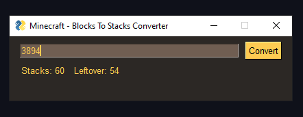

# blocksToStacks

<div align="center">
    
</div>

## Introduction
This program is a small GUI tool to convert a number of blocks to a number of stacks when playing [Minecraft](https://www.minecraft.net/en-us)

## Installation
Firstly install PySimpleGUI
```bash
pip install PySimpleGUI
```

Then clone the repo
```bash
git clone https://github.com/swishyy/blocksToStacks.git your-project-name
```

Then run the main file to open the program
```bash
cd your-project-name
python main.py
```
## Download
You can download the latest version [here](https://github.com/swishyy/blocksToStacksApp/releases/tag/v1.0.0)

## Credits
Made almost entirely with the [PySimpleGUI](https://github.com/PySimpleGUI/PySimpleGUI) library

## Contributing
All pull requests are welcome and be sure to let me know if there are any bugs.

## License
[MIT](https://choosealicense.com/licenses/mit/)